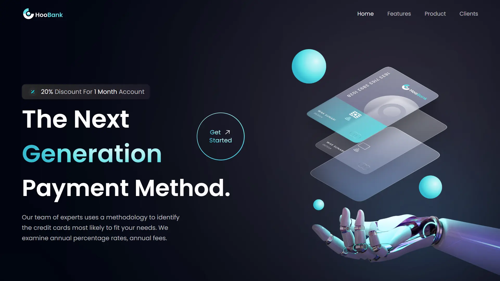

<div align="center">
    <a href="https://hoobank-fv.netlify.app" target="_blank">
      
    </a>
  <h3 align="center">Bank - React UI</h3>
</div>

##  <br /> 📋 <a name="table">Table of Contents</a>

- ✨ [Introduction](#introduction)
- ⚙️ [Tech Stack](#tech-stack)
- 📝 [Features](#features)
- 🚀 [Quick Start](#quick-start)

##  <br /> <a name="introduction">✨ Introduction</a>

**[EN]** This bank landing page showcases a contemporary design developed using React, emphasizing reusable functional components and a well-organized file and folder structure. It integrates Tailwind CSS for streamlined styling, emphasizing mastery of fundamental CSS properties such as flex for flexible layout design. Responsive design is ensured with meticulously implemented media queries, optimizing display across all devices.

**[FR]** Cette page d'accueil présente un design contemporain développé avec React, mettant l'accent sur l'utilisation de composants fonctionnels réutilisables et une structure de fichiers bien organisée. Elle intègre Tailwind CSS pour un style simplifié, mettant en avant la maîtrise des propriétés CSS fondamentales telles que flex pour des designs de mise en page flexibles. Le design responsive est assuré grâce à des media queries soigneusement implémentées, optimisant l'affichage sur tous les appareils.

##  <br /> <a name="tech-stack">⚙️ Tech Stack</a>

- **React** is a popular JavaScript library for building user interfaces, particularly single-page applications where data changes over time. React's component-based architecture allows developers to create reusable UI components, making development more efficient and the codebase easier to maintain. 

- **Tailwind** is a utility-first CSS framework that speeds up UI development by providing a set of pre-built utility classes. It allows developers to quickly build custom designs without writing traditional CSS, promoting rapid prototyping and design consistency.

- **Vite** is a modern frontend build tool known for fast ES Module imports, efficient bundling, and quick development server startup times. It supports frameworks like Vue.js and React, optimizing workflow and performance compared to traditional bundlers.


## <br/> <a name="features">📝 Features</a>

👉 React functional reusable components.

👉 React file and folder structure.

👉 Tailwind CSS styling

👉 Fundamental CSS properties to master flex

👉 Soft animations and complex gradients.

👉 Media queries for satisfactory responsiveness covering almost devices.


## <br /> <a name="quick-start">🚀 Quick Start</a>

Follow these steps to set up the project locally on your machine.

<br/>**Prerequisites**

Make sure you have the following installed on your machine:

- [Git](https://git-scm.com/)
- [Node.js](https://nodejs.org/en)
- [npm](https://www.npmjs.com/) (Node Package Manager)

<br/>**Cloning the Repository**

```bash
git clone {git remote URL}
```

<br/>**Installation**

Let's install the project dependencies, from your terminal, run:

```bash
npm install
# or
yarn install
```

<br/>**Running the Project**

Installation will take a minute or two, but once that's done, you should be able to run the following command:

```bash
npm run dev
# or
yarn dev
```

Open [`http://localhost:3000`](http://localhost:3000) in your browser to view the project.